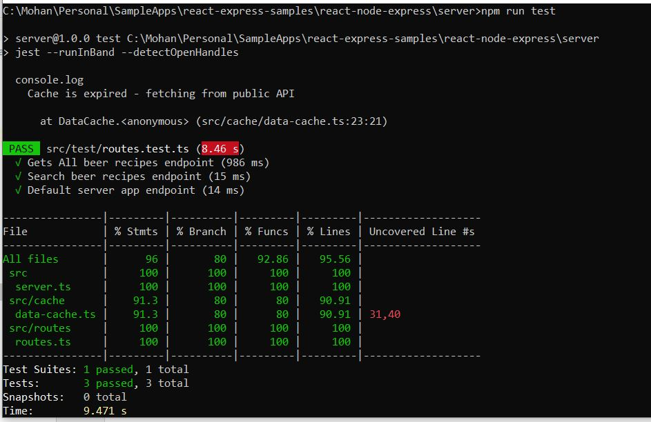
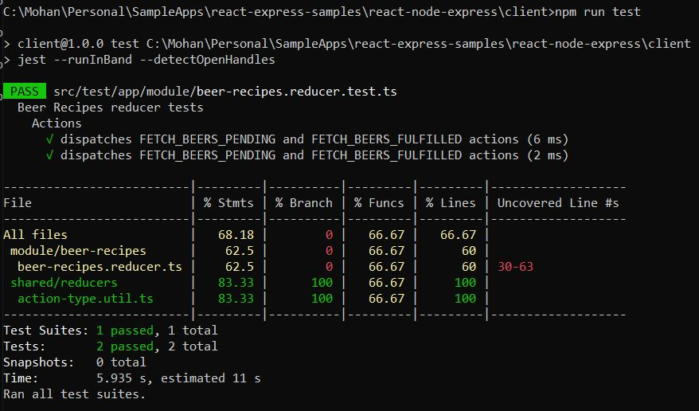
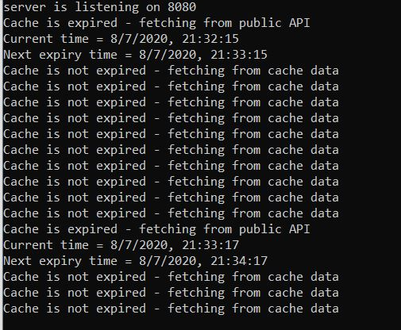

## Node Express Server and React Redux web application

Sample web application for data list, search and sorting data without any database using react redux node express 

### Getting Started

This application is developed with decoupled architecture design where server and client apps are deployed separately.


### Technologies

**Frontend**

* [Node] v12.x.x 
* Npm v6.x.x
* React Redux
* Typescript
* Webpack

**Backend**

* [Node] v12.x.x 
* [ExpressJS]
* Npm v6.x.x
* Typescript


```Make sure node is installed and set the path in the system before proceeding to deployment steps.```

### App Structure

```Note: I am mentioning only high level files/folders ```

```bash

├── react-node-express
│   ├── client
│   │   ├── src
│   │   │   ├── test
│   │   │   │   ├── app
│   │   │   ├── webapp
│   ├── server
│   │   ├── src
│   │   │   ├── test
│   │   │   │   ├── routes.test.ts
│   │   │   ├── cache
│   │   │   ├── model
│   │   │   ├── routes
│   │   │── index.ts
│   │   │── server.ts

```

Let's get into build and deployment steps. 

Open two terminal or command-line shell then navigate to the application path and execute the below script. 

**Run the express server**

In Terminal#1 Navigate to ```react-node-express\server``` and execute below command 

> Terminal#1: npm install && npm run start

**Run the react client**

In Terminal#2 Navigate to ```react-node-express\client``` and execute below command 

> Terminal#2: npm install && npm run start

### Test cases execution

**Server**

Execute below command 

> Terminal#1: npm run test

**Client**

> Terminal#2: npm run test

### Test Results Screen

Server



Client 



### Features

* No Database or JSON or full text search engines
* In-Memory Cache Manager at backend to serve data 
* Having Configurable cache life or "time-to-live" (TTL)
* Reusable for other types of data
* Unit test using [Jest]
* Having better memory efficiency 

### Nonexistent Features

* Client test cases covered only for few functions not for all functions

### In Memory Cache Screen

* "time-to-live" (TTL) set as 1 Minute 



[Node]:https://nodejs.org/download/release/v12.13.0/
[Jest]:https://www.npmjs.com/package/jest
[ExpressJS]:https://www.npmjs.com/package/express
